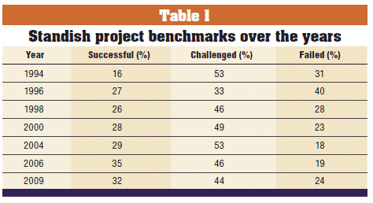
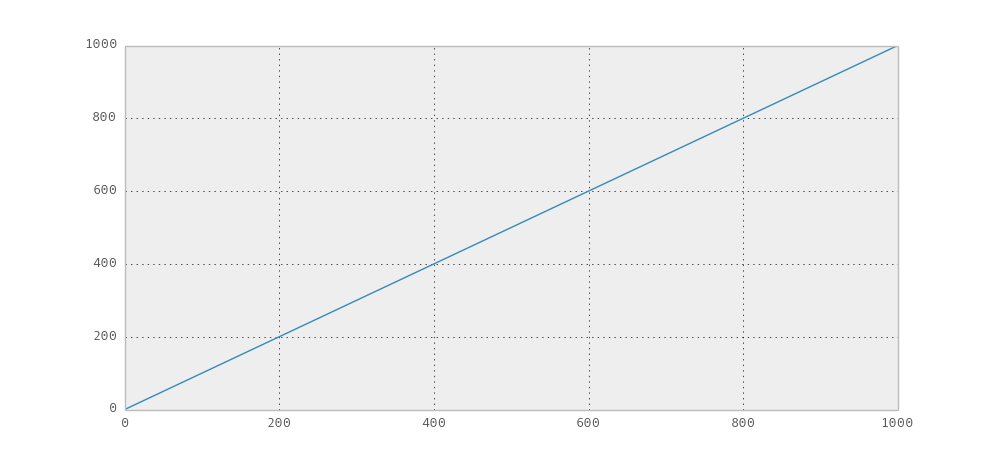
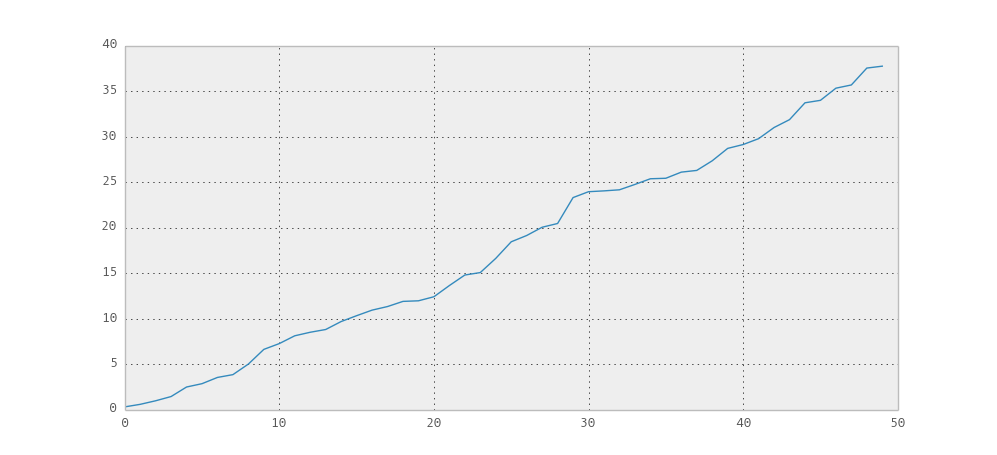

%%%%%%%%%%%%%%%%%%%%%%%%%%%%%%%%%FEEEEEELINGS AND IDENTITY

http://hbr.org/2011/09/why-your-it-project-may-be-riskier-than-you-think/
http://eureka.bodleian.ox.ac.uk/4745/1/Budzier_and_Flyvbjerg.pdf
http://onlinelibrary.wiley.com/doi/10.1002/pmj.21409/full

http://eight2late.wordpress.com/2008/03/04/on-the-inherent-uncertainty-of-project-tasks-estimates/
http://arxiv.org/pdf/1304.4590.pdf 

Introduction
---

What is the variance of the expected time of a human endeavor of construction or creation, a project? _Infinite._ The reason why is that project times don't follow a well-behaved normal distribution, but a power law.

>"You will be home before the leaves fall from the trees."
>
>_Kaiser Wilheim II of Germany, August 1914. The war went on for four years._

People have thought a lot about why huge failures in time forecasting occur. There's no silver bullet for solving them, said Fred Brooks, as to why software is hard. 

But I think the beginning of the examination should be _how_ these huge failures occur: that is, the geometry and structure of the project that is fucking up.

I think some ideas from B. Mandelbrot's work can shed some light on that structure.

People have thought in this way before, but I'm not sure if it's been popularized among the greater programmer population.

What?
----

Let's look at some data first. It's not infinite, but it's reaching well towards it.

(graph of power law of project sizes)

(put the github analysis here: can you do an exegesis in only like a paragraph, and a moral?)

suez canal, scottish parliament building, sydney opera house. print whole table. note power law distribution of table

Infinite variance in stock markets. First predictive thought in economics. Mandelbrot's cotton prices.

Matthew effect. Herbert Simon said preferential attachment. Note how this accords exactly with Brook's Law: adding programmers to a late programming project makes it later.

A Pretty Mental Model
-----------

The naive model in some people's heads of software projects is that of uniform progression towards the goal. Let's agree that this is idiocy and not talk about it anymore.

Another model we can think about is a one-tailed (people are, to a first approximation, never early) normally distributed random walk in 1-dimensional space. That means that there are things in there, but there are no radical explosions. There is, implicitly held in many cases, an assumption of normality in the scheduling of production processes.

It is assumed that with some dilligent effort and enough (lots! lots more!) estimation, estimates will veer closer to the truth. That's the great central limit theorem.

This is wrong for a different reason. Central limit theorem can't hold, it's not IID. It's not even a martingale, there's strong long-range correlations. What happens if you decide at the start of a web app project to use APL? Your foolishness will affect every aspect of the entire project.

More concretely, here's an example of a single, specific thing that fucked up a project (from Soul of a New Machine, probably) (maybe that guy who got writer's block for 30 years)

Another pattern in time, however, which isn't normal, noted by Mandelbrot is the patterning of noise in information.

Describe Mandelbrot's encounter with the telephone error data.

But it is also admitted at the same time that errors abound which scale to the size of the temporal interval you're estimating at.

To Mandelbrot, noise in his telephone data was patterned like a Cantor set: errors are inevitable and do not go away with enough data, because the process by which the errors occur scale with the size of the temporal interval that you're looking at.

(picture of devil's staircase model)

We might think of this as another model for the timing of design work, wars, and other processes in which these events which have lots of the properties of electrical noise happen in time and invariant to the scale of things. Delays accumulate in jumps. (mention the critical path people).

Imagine you were on this devil's staircase. You couldn't find out which scale you were on specifically, and you would give up. More specifically, talking about progress is very meaningless, just like actual progress bars.

Instead, you would figure out how many doublings of time, or triplings, or what have you, you were going to go through, and try to make your predictions in a power law space instead.

Why does this phenomenon happen? Power laws have a fat tail, and that's what you care about most in the land of f(x), not x. The time of things is f(x). That's what we are seeing in the cost overruns, a big fat tail.

Talk about the MCMC kids, how they do sample from the posterior. They also actually assume normality a lot of the time, but sometimes they don't. It's possible to get it right there, at least.

Caveats
====

I've only talked about the _shape_ of software projects. Power laws, presumably, have generating stochastic processes. There's a lot of them. Different points of view towards estimation are engendered by taking on any of the possible sources of models (that is their point).

The only previous connection this strange class of models which involve power laws has had with software projects is in the Pareto principle, which states that 80% of the effect is caused by 20% of the cause. You see people call power law distributions Pareto distributions, in social science land.

The models which I have mentioned are all models, and therefore all convenient lies. They should not really be said to have a reality, but merely a usefulness. However, they seem useful to me in this domain.

Practical Steps
=====

Although it is probably the case that this essay will seem more useful than it is, if you choose to adopt a fractal time model for your scheduling, there are things to keep in mind, from less technical to more technical. I'm not selling anything. Go use the existing easy statistical tools.

Keep track of the speed of the doublings of things, says a Cantor dust model of progression in software projects, because the structure of the progress made is invariant with respect to scale. You might take power law statistics instead of normal people ones.
 
The practice of estimating their time periods should be discontinued, as estimates in a distribution such as the one that governs software projects have no meaning.

Use a Kolmogorov-Smirnoff estimate which cleaves to previous data that exists about software projects is best. Just a mention of the differential models, many other models that exist that are compatible with this fact.

Short Conclusion
=====
There is no normal time for a software project.
